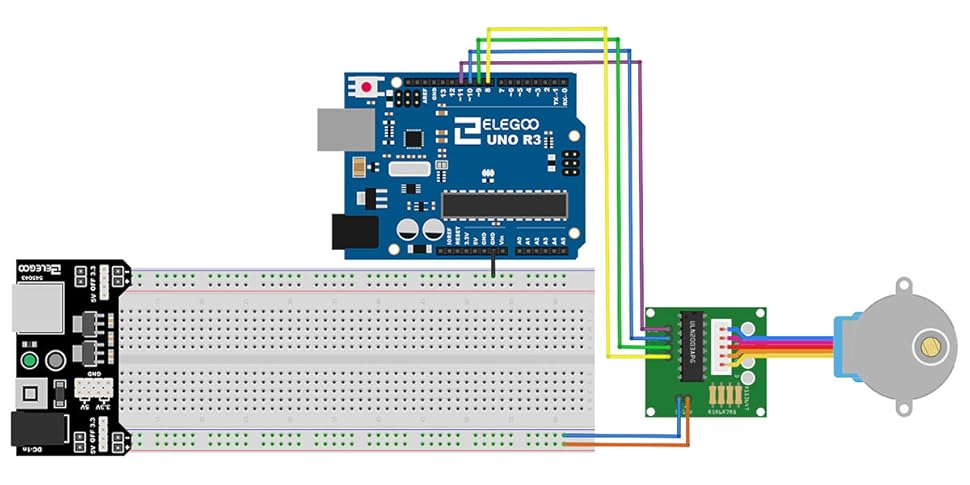

# Funky Clock

This code powers the funky clock. Basic outline of the project is found in google docs: [here](https://docs.google.com/document/d/1V5356tUVx-YD0CHarGajh9jf_4kO4p0FzXMW7qBXxqQ/edit?tab=t.0).

This project demonstrates how to control a 28BYJ-48 stepper motor using an ESP32 microcontroller and a ULN2003 driver board. The motor rotates precisely one full revolution in both clockwise and counterclockwise directions, pausing briefly between rotations.

---

## Features

- Drives the 28BYJ-48 stepper motor using half-stepping for smoother operation.
- Performs precise control of motor rotation with configurable speed.
- Supports bidirectional rotation.

---

## Hardware Requirements

- ESP32 microcontroller (WROOM-32)
- 28BYJ-48 stepper motor
- ULN2003 driver board
- External 5V power supply
- Jumper wires

---

## Wiring Diagram

### Connections

| ULN2003 Driver | ESP32 GPIO |
| -------------- | ---------- |
| IN1            | GPIO 25    |
| IN2            | GPIO 26    |
| IN3            | GPIO 27    |
| IN4            | GPIO 14    |
| VCC (+)        | 5V         |
| GND (-)        | GND        |

---

Example of wiring diagram: 

## Software Setup

### Prerequisites

1. Install the [Arduino IDE](https://www.arduino.cc/en/software).
2. Install the ESP32 board package in the Arduino IDE:
   - Open **File > Preferences**.
   - Add the URL: `https://dl.espressif.com/dl/package_esp32_index.json`.
   - Go to **Tools > Board > Boards Manager** and search for "ESP32" to install the package.

### Code

The Arduino sketch is included in this repository. It contains functions to rotate the stepper motor clockwise and counterclockwise, completing one full revolution in each direction.

---

## Usage

1. Wire the ESP32, ULN2003, and stepper motor as described above.
2. Open the Arduino IDE and upload the provided sketch to the ESP32.
3. Observe the motor rotating one full revolution in both directions, with a pause between rotations.

---

## Customization

- **Rotation Speed:**

  - Adjust the delay value in the `rotateStepper()` function to control the speed of the motor. Lower values increase speed, but ensure the motor doesn't skip steps.

- **Steps Per Revolution:**
  - Modify the `STEPS_PER_REVOLUTION` constant if you're using a different stepper motor model.

---

## Troubleshooting

1. **Motor Buzzes but Doesn’t Rotate:**

   - Ensure the motor has sufficient power (use an external 5V power supply if necessary).
   - Verify the board has not overheated.
   - Verify the wiring connections.

2. **Incorrect Rotation:**

   - Ensure the step sequence matches the motor's wiring.

3. **Skipping Steps:**
   - Increase the delay between steps to reduce speed and improve torque.

---

## License

This project is open-source and free to use. Contributions and modifications are welcome!
